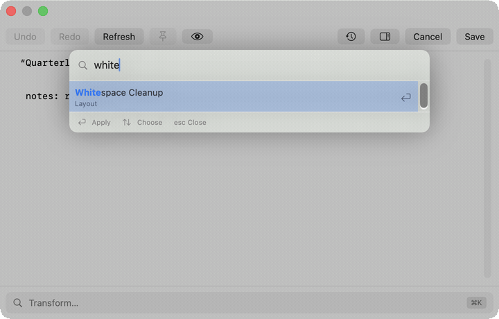

# Pastefix

Pastefix is a small macOS menu-bar app for fixing up whatever you just copied before you paste it.

Copy something, press **⌘⇧C**, and a panel opens over the app you're in with your clipboard in it. Clean it up with a transform or edit it by hand, press **⌘S**, and the fixed version is back on your clipboard, ready to paste. No window switching, no Dock icon, no pasting into a scratch file first.

Things you can do with it:

- **Clean up text:** strip stray whitespace, reflow paragraphs, turn smart quotes and accents into plain ASCII, or convert between camelCase, snake_case, kebab-case and CONSTANT_CASE.
- **Read data:** prettify or minify JSON, decode a JWT, decode Base64, percent-encoding or HTML entities.
- **Tidy links:** strip `utm_*`, `fbclid` and other tracking parameters from every URL, or turn a URL into a Markdown link with the page's title.
- **Work with screenshots:** pull the text out of an image (OCR), or strip a photo's location and camera metadata before you share it.
- **Catch secrets:** Pastefix flags API keys, tokens, private keys and passwords in what you copied, and one transform redacts them all before you paste or share.
- **Get back what you copied earlier:** a searchable clipboard history, with pinned snippets that never age out and can each have their own global hotkey.
- **Share it:** upload the text or image to your own self-hosted [Zipline](https://zipline.diced.sh) server and get a short link on your clipboard.
- **Add your own:** any shell script or JavaScript function in your scripts folder shows up as a transform.

<!--
docs/media/pastefix-tour.gif: window-only captures of planted demo content (no real clipboard or
history), 720 px wide, ~21 s. Scenes: the ⌘K palette on messy text; JSON Prettify; Clean URL
Tracking (before/after); a secret found and redacted; Extract Text on a screenshot (before/after);
Strip Image Metadata; the history overlay with a pinned snippet. Rebuild from 1440×920 PNGs with
ffmpeg concat + palettegen (256 colours, bayer dither), -fps_mode vfr.
-->


## Contents

- [Install and set up](#install-and-set-up)
- [Using Pastefix](#using-pastefix)
- [Known limitations and gotchas](#known-limitations-and-gotchas)
- [Privacy: what leaves your Mac](#privacy-what-leaves-your-mac)
- [Contributing](#contributing)

## Install and set up

### Requirements

macOS 15 or later.

### Download

Download the latest notarized DMG from [GitHub Releases](https://github.com/bnaylor/pastefix/releases) and drag Pastefix to Applications.

Pastefix keeps itself up to date with [Sparkle](https://sparkle-project.org). It checks once a day and asks before installing anything. **Check for Updates…** in the menu-bar menu checks on demand. Settings → General has an **Automatically check for updates** toggle, a **Check Now** button, and the installed version. Updates are EdDSA-signed and Developer-ID-verified.

### First run

Launch Pastefix and a clipboard icon appears in the menu bar. There's no Dock icon and no main window: everything starts from a hotkey or the menu-bar menu.

### Global hotkeys

| Hotkey | What it does |
|---|---|
| **⌘⇧C** | Open the panel with what's on the clipboard |
| **⌘⇧V** | Open clipboard history |
| **⌘⇧U** | Upload to Zipline |

Rebind any of them in **Settings → Shortcut**. ⌘⇧V and ⌘⇧U collide with shortcuts in some other apps; see [Known limitations](#known-limitations-and-gotchas).

### Accessibility permission

Pastefix asks for Accessibility permission for one thing only: pasting a pinned snippet for you (a snippet hotkey, or ⇧↵ in the history overlay), which means sending ⌘V to the frontmost app. It asks the first time that actually happens. Everything else works without it, and snippet hotkeys still copy the snippet if you never grant it. Settings → Snippets shows the current status and links to System Settings.

### Scripts folder

Your own transforms live in `~/.config/pastefix/scripts/` by default. Change the folder in Settings → General. Pastefix watches it, so adding or editing a script updates the palette without a relaunch. See [User scripts](#user-scripts).

### Zipline setup

To use ⌘⇧U, open **Settings → Upload** and enter your Zipline v4 server URL, then type your API token and press **Set Token**. The token is stored in the Keychain, never in Settings. A token you type and then quit without pressing Set Token is not saved. **Clear Token** removes it.

Private, LAN and Tailscale addresses are the expected way to reach a self-hosted Zipline. Plain `http` works for an IP address (a Tailscale 100.x one included) and for a `.local` name. A named host such as `box.tailnet.ts.net` needs `https`, which Tailscale issues a certificate for. There's no certificate-trust bypass, so a self-signed certificate fails the upload by design.

### Settings

Open Settings with ⌘, or **Settings…** in the menu. All settings persist in `UserDefaults`. There are seven tabs:

- **General:** wrap width (default 400 columns), hide the panel when it loses focus, the user scripts folder (default `~/.config/pastefix/scripts/`), and updates.
- **Privacy:** a **History** section (remember-history toggle, how many items to keep, and Clear History, which offers "Clear N items" for unpinned items only, or "Clear Everything") and an **Excluded Apps** section (add or remove apps whose copies are never read into history; Restore Defaults).
- **Snippets:** the Accessibility status ("ready" or "needs Accessibility permission", with a shortcut to System Settings) and your pinned snippets, each with an editable title, its own global-shortcut recorder, and Unpin.
- **Shortcut:** rebind ⌘⇧C, ⌘⇧V and ⌘⇧U with a keyboard recorder.
- **Transforms:** enable or disable individual transforms and drag to reorder them. **Reset usage ranking** forgets which transforms you've used, so the palette goes back to your order among equals.
- **Presets:** your regex find & replace rules. See [Regex presets](#regex-presets).
- **Upload:** the Zipline server URL, API token, and the defaults ⌘⇧U opens with (expiration, burn after reading, file type).

## Using Pastefix

### The basic flow

1. **Summon.** ⌘⇧C snapshots the clipboard and opens the panel.
2. **Transform.** Press ⌘K (or click the **Transform… ⌘K** bar at the bottom) to open the command palette. Pick a transform and the editor updates at once. If a transform fails, a red banner says why and your text is left as it was.
3. **Edit.** The monospaced editor is freely editable. Undo, Redo and Refresh are in the toolbar.
4. **Save (⌘S).** Writes the working text back to the clipboard and closes the panel.
5. **Cancel (Esc).** Discards your changes and closes the panel.

**Undo.** Typing and transforms share one undo stack. ⌘Z and ⌘⇧Z (and the toolbar Undo and Redo) step back and forward through both, in the order they happened, in text and image sessions alike. Pressing ⌘Z while a transform is still running cancels it first.

### Images

A clipboard holding only a picture opens the panel as a picture instead of an empty editor. Save puts it back unchanged. What you see follows the content, not a mode you pick: anything with real text opens the editor, and an image alongside that text is carried along for Save even though it isn't shown.

Two image transforms appear in the palette for a picture:

- **Strip Image Metadata** removes location, camera and other metadata, tells you what it removed (or that there was nothing to remove), and puts the clean image on the clipboard when you Save. ⌘Z brings the original back. Your history still holds the original you copied, metadata and all, until you remove it (⌘⌫ in the history overlay).
- **Extract Text (OCR)** reads the text in the picture and puts it in the editor in place of the picture. If it finds nothing, it says so rather than emptying the editor. ⌘Z undoes any typing you've done since, then brings the picture back.

A photo copied from Photos opens as a picture, even though Photos also puts a file reference on the clipboard. A file copied in Finder and a picture embedded in formatted text do not; see [Known limitations](#known-limitations-and-gotchas).

### Finding transforms

**Palette (⌘K).** Type to filter, ↑↓ to choose, ↵ (or a click) to apply, Esc to close. Typing matches a prefix, a word start, or, failing those, a loose subsequence. Camel-case boundaries count as word starts, so `case` finds `camelCase`. Transforms that apply to the detected content are listed first. Among transforms that are otherwise equal, the ones you use often or recently come first; usage never outranks a better match or a fit with the content, and the sidebar keeps your own order. In an image session the palette lists the image transforms. When nothing is listed, it says "No matching transforms" (your search matched nothing), "No transforms enabled", or "No image transforms enabled". Esc closes the palette first; a second Esc, with the palette already closed, cancels the panel.

**Sidebar (⌘⇧L or the toolbar button).** Browse every enabled transform grouped by category. Right-click a transform and choose **Add to Favorites** to put it in a **Favorites** section at the top, in the order you add them; it stays in its own category too. The sidebar always keeps your configured order, so it doesn't reshuffle as you copy different things. Whether it's open is remembered. The panel widens by the sidebar's width when it opens and gives the width back when it closes, and you can resize the panel yourself. The panel remembers its size and where you put it: it opens at the same spot, relative to the screen, on whichever display you're using (the one with the mouse).

**Transforming a selection.** Select part of the text first and a transform changes only that part: the palette and sidebar say **Applies to selection**, and the result stays selected so you can run another transform on it. ⌘Z puts the original text back and selects it again. A caret, select-all or a multi-range (⌘-drag) selection transforms the whole buffer, as do the three rich-text transforms (Rich → Plain Text, Rich → Markdown, Markdown → Rich Text), which are marked **whole buffer** while text is selected. If the text changed between selecting and applying (for example, an unfinished accent was discarded), the transform stops and asks you to select again. With a selection of 8 KB or less, the palette lists the transforms that fit the selected text first. A script's trailing newline is dropped when the selection didn't end in one, so transforming a word inside a line doesn't split the line.

### Content detection

When the buffer matches a recognised kind, a `Detected: …` label appears beside the Transform… bar and matching transforms are listed first in the palette. Nothing is hidden, and your enable and reorder settings still apply. The kinds:

- **URL:** the buffer contains a link.
- **JSON:** the whole buffer parses as JSON.
- **Color:** the whole buffer is a colour literal (`#hex`, `rgb()`, `hsl()`, …). A 14×14 swatch of the colour appears next to the label.
- **JWT:** the whole buffer is three base64url segments whose header decodes to JSON with an `alg` key.
- **Base64:** the whole buffer is 16+ characters that decode to printable text.
- **Percent-encoded:** the buffer contains a `%XX` sequence.
- **HTML entities:** the buffer contains a `&name;` or `&#n;` reference.
- **Markdown:** the buffer contains an ATX heading or fence line, or at least two of: a list line, a `> ` quote, a pipe-table row, a `[text](url)` link, `**strong**` or `` `code` `` inline. A buffer whose first line is a `#!` shebang is never treated as Markdown.

Secrets have their own badge instead; see [Secrets](#secrets).

### Markdown preview

The eye button (⌘⇧M) swaps the editor for a read-only rendering of the buffer as Markdown. It's tinted when Markdown is detected. Esc returns to the editor. Links you click in the preview open in your browser (http, https and mailto only).

### Clipboard history

Pastefix remembers what you copy: plain text, formatted (rich) text and images, up to 200 items and 50 MB total. Per item, the limits are 256 KB of text, 1 MB of rich text, and 5 MB per image. Oversize items are dropped, not truncated.

Press **⌘⇧V** anywhere, or **⌘Y** inside the panel, to open the history overlay:

| Key | Action |
|---|---|
| type | filter |
| ↑↓ | choose |
| ↵ | load the item into a new session |
| ⌘↵ | put the item back on the clipboard and close, without opening it |
| ⇧↵ | copy the item, close, and paste it into the app you were in |
| ⌘P | pin the item |
| ⌘⌫ | forget the item |
| Esc | close the overlay |

A loaded item opens the way a fresh copy would: any real text, plain or rich, opens in the editor (formatting is kept for Rich → Plain Text), with an attached image carried along for Save; only an image with no text at all opens as a picture.

Copying the same thing again moves it back to the top instead of adding a duplicate, and keeps crediting the app that originally put it on the clipboard. Reusing an item from history doesn't relabel it as coming from Pastefix. Items that password managers and similar tools mark as concealed, transient or auto-generated are never recorded, including a few legacy marker conventions older apps still use.

History lives in `~/Library/Application Support/Pastefix/history/`, readable only by your user account. The **Clipboard History** checkmark in the menu-bar menu turns capture on and off on the fly. While it's off, the menu-bar icon switches to a pause glyph so you can see nothing is being recorded.

**Excluded apps.** Settings → Privacy has an Excluded Apps list, seeded with common password managers (1Password, Bitwarden, Keychain Access, Apple Passwords, Dashlane, LastPass, KeePassXC, Enpass, NordPass, Proton Pass, Strongbox). Copies made in a listed app are never read into history. Add an app from `/Applications` or by typing its bundle identifier, remove entries, or press **Restore Defaults** to get the seed list back. ⌘⇧C still reads whatever is on the clipboard, because you asked for it, and saving from the panel writes it back, which is recorded like any other copy.

The source app is decided from whichever app was frontmost *before* the clipboard is read. If you switch apps within a second of copying, both apps count as possible sources and the copy is skipped if either is excluded.

### Pinned snippets

Pin anything you want to keep past the history limits. Pin from the history overlay with **⌘P** (untitled), or from the panel with the toolbar pin button or **⌘⇧P**, which lets you add a title. Pinned items get their own **Pinned** section above History in the overlay, newest-pinned first, and never age out.

**Per-snippet hotkeys.** In Settings → Snippets, record a shortcut for a pin. Pressing it anywhere writes the snippet to the clipboard and sends ⌘V to the frontmost app. Two pins can't share a shortcut. Without Accessibility permission, a snippet hotkey still copies the snippet and beeps once so you know to paste it yourself. ⇧↵ in the overlay copies and closes silently, and beeps only if the paste it lined up never lands.

Unpinning is reversible: the title and shortcut stay with the item, so pinning it again brings both back. They're forgotten only when the item leaves your history. Clear History keeps your pins; only Clear Everything removes them.

### Secrets

Pastefix watches the working buffer for credentials: AWS access keys, AWS secret keys, GitHub tokens, Anthropic keys, OpenAI keys, Slack tokens, Stripe keys, Google API keys, private key blocks, JWTs, passwords embedded in URLs, and generic high-entropy `key = value` assignments, including passwords full of punctuation such as `password: hunter2!SuperSecret99`.

The scan also sees through lookalike characters: Cyrillic and Greek letters that look Latin, fullwidth characters, dash variants, `Ø` for `0` and `×` for `x`. OCR output often contains these, and so does a deliberately disguised paste. Redaction replaces the characters actually in your text.

When a secret is found:

- An orange **N secret(s)** badge appears in the action bar. Its tooltip lists the kinds found, and clicking it selects the next match in the editor, cycling through all of them.
- **Redact Secrets** (Privacy category) replaces every match with a `[REDACTED <kind>]` token. A password in a URL keeps its `user:` and host and loses only the password. Running it again on redacted text changes nothing.
- In the history overlay, a small shield marks any item, pinned or not, that contains a secret.

Nothing is blocked. Pastefix never refuses to capture or save something because it looks like a credential, and ⌘S behaves the same.

### Regex presets

**Settings → Presets** lets you define find & replace rules as regular expressions, with no script needed. Choose a preset from the menu at the top, or press **+** for a new one. A new preset is an unsaved draft, marked *(unsaved)*, and doesn't reach the palette until you press Save.

Each preset has a name, a pattern, a replacement, and four flags:

- **Case-insensitive**
- **^ and $ match at line boundaries**
- **. matches newlines**
- **Replace all matches** (off replaces only the first)

Patterns and replacements use `NSRegularExpression` syntax, so a replacement can reference capture groups with `$1`, `$2` and so on. The replacement field is one line, so it understands a few escapes: `\n` is a newline, `\t` a tab, `\\` a literal backslash, and `\$` a literal dollar sign instead of a group reference. Any other escape is kept as typed, so `\d` inserts the two characters `\d`.

Under the fields, a sample box shows a **live preview**: the transformed sample and a match count as you type, or an inline error if the pattern doesn't compile. The preview uses at most 16 KB of the sample and gives up after 1 second, so an expensive pattern can only stall the preview, never the panel.

Save is disabled while the name is blank or the pattern doesn't compile. An empty pattern counts as not compiling ("Pattern is empty"). A preset with unsaved edits is marked **•**, and switching away from it or removing it asks first. Leaving the tab or closing Settings saves a valid unsaved preset automatically. An invalid one is kept while you switch tabs, but not once the window closes.

A saved preset works like any other transform: it's in the palette and in the sidebar under **Presets**, and you can enable, disable and reorder it in Settings → Transforms. Deleting a preset also forgets its settings there. Presets have their own limits; see [Transform limits](#transform-limits).

### Zipline upload

**⌘⇧U** uploads the working text to your self-hosted [Zipline](https://zipline.diced.sh) v4 server and replaces the clipboard with the short URL it returns. Zipline v4 only.

**What gets sent.** With the panel closed, ⌘⇧U snapshots the clipboard, the same as ⌘⇧C. With the panel open and the buffer unedited, it re-reads the clipboard if that has changed since. Once you've edited the buffer, your edits win over a newer clipboard. The overlay's header always names what it's about to send ("the clipboard" or "the panel buffer") and its size.

**Secret check.** Text is scanned for secrets in full before upload, with no size cap. If something is found, you see the kinds found and a choice: **Redact** (preselected; Return uploads the redacted copy) or send as-is. Redaction only changes the uploaded copy. Your buffer and clipboard are untouched.

**Images.** When the session is showing an image, ⌘⇧U uploads the image. Its location and camera details are stripped first, and the overlay says so. Images are **not** checked for secrets, and the overlay says that every time. If it detects text in the image, it says so, the button reads "Upload without checking", and Return cancels instead of uploading.

A photo goes up as JPEG (quality 0.85), anything else as PNG. The choice is measured: an image with every pixel opaque whose JPEG is at most half the size of its PNG goes as JPEG. The overlay then shows both sizes ("Sending as JPEG (1.6 MB; as PNG it would be 10.1 MB)") and a one-click **Send as PNG instead**. A full-screen screenshot with the wallpaper showing compresses like a photo, so that button is how to send one losslessly. Anything with a transparent pixel always goes as PNG. When the PNG is over the 16 MB upload limit, an opaque image goes as JPEG whatever the ratio, and the overlay says why. An image still over 16 MB in the format it would be sent in is refused.

**Expires** (Never, 1 hour, 1 day, 7 days) and **Burn after reading** are separate controls, because Zipline treats them separately; a paste can be both.

**Burn after reading** means *only the first person to open the link can see it*: Zipline remembers who viewed it first, lets them open it again, and deletes it for anyone else.

- **Don't open a burn-after-reading link yourself to check it.** That uses it up, and the person you send it to gets nothing.
- **Link previews count.** Pasting one into Slack, Discord or iMessage lets the app fetch a preview, and that fetch is the one view. Burn after reading suits links sent where nothing previews them.
- The Open button after such an upload warns you.

**File type** sets the uploaded file's extension, which is how Zipline v4 picks syntax highlighting. It defaults to `json` when the buffer looks like JSON and `txt` otherwise. Your Settings → Upload default wins whenever you've set it to something other than `txt`, and anything you type into the field wins over both.

On success, the clipboard holds the short URL and the overlay shows it with buttons to copy it again and to open it. The URL is recorded in clipboard history like any other copy.

### Large clipboards

On a very large paste the panel appears first, and the `Detected:` label and secret badge fill in a moment later. Over 1 MB of text, the panel doesn't lay the text out at all, since that costs about a second per megabyte; it shows the size instead, with **Show anyway** if you want to scroll or edit it. Save and ⌘⇧U work on all of it. Most transforms stop at their 1 MB input cap and say so.

### Built-in transforms

Thirty built-in transforms, grouped in the sidebar by category in this order. Your regex presets follow under **Presets**, then any custom script categories alphabetically, then **Scripts**.

| Category | Transforms |
|---|---|
| Layout | Wrap & Reflow, Whitespace Cleanup, Clean Claude Code Paste |
| Rich Text | Rich → Plain Text, Rich → Markdown, Markdown → Rich Text |
| Characters | Transliterate to ASCII |
| URLs | Clean URL Tracking, URL → Markdown Link |
| Case | camelCase, snake_case, kebab-case, CONSTANT_CASE |
| Data | JSON Prettify, JSON Minify, Escape as JSON String, Base64 Encode, Base64 Decode, URL Encode, URL Decode, HTML Encode, HTML Decode, Decode JWT |
| Colors | Color → CSS Hex, Color → CSS rgb(), Color → CSS hsl(), Color → SwiftUI Color |
| Privacy | Redact Secrets, Strip Image Metadata |
| Images | Extract Text (OCR) |

#### Layout

- **Wrap & Reflow:** rewraps text to the configured width (default 400 columns), respecting paragraph breaks.
- **Whitespace Cleanup:** trims leading and trailing spaces and tabs from each line, and collapses repeated blank lines.
- **Clean Claude Code Paste:** tidies text copied out of a Claude Code terminal for pasting into Slack, Google Chat or a doc. It removes the 2-space margin, rejoins lines the terminal wrapped at its width while keeping real line breaks, bullets, numbered items, tables and code blocks, and drops terminal chrome (`⏺` markers, `✻ … for 11s` status lines, `(ctrl+o to expand)`). Your `❯` prompts become `> ` quotes. One limit: a deliberate line break right after the widest line of the paste, with the next line at the same indent, can't be told from a wrap and is joined.

#### Rich Text

- **Rich → Plain Text:** extracts plain text from the clipboard's original rich (RTFD) content.
- **Rich → Markdown:** converts the clipboard's original rich text to GitHub-flavoured Markdown: headings, bulleted and numbered lists (with nesting), bold, italic, strikethrough, links, and inline or fenced code from monospaced runs. Headings come from the HTML heading level when there is one (browser copies). Otherwise a whole-paragraph bold run is measured against the most common point size of the surrounding non-bold text and becomes `#`, `##` or `###` at 1.8×, 1.4× or 1.15× that size, falling back to a 13 pt baseline when everything is bold. Tables are flattened to `|`-joined lines, one per row, with no header separator. Images are dropped.
- **Markdown → Rich Text:** doesn't change the buffer; it sets how the next Save writes it. While it's on, a **Rich text on save** badge appears in the action bar, and ⌘S writes `public.html` (the rendered fragment), `public.rtf` (AppKit's conversion of that HTML), and the Markdown source as `public.utf8-plain-text`. A formatted target such as Mail, Pages or a browser gets rich text, and a plain-text target still gets the Markdown. Click the badge to turn it off. Every new session starts with it off.

#### Characters

- **Transliterate to ASCII:** converts smart punctuation, diacritics and other non-ASCII characters to ASCII equivalents (é → e, curly quotes → straight quotes, emoji dropped).

#### URLs

- **Clean URL Tracking:** removes tracking parameters (`utm_*`, `fbclid`, `gclid`, `si`, `mc_cid`, …) from every URL in the text. Other parameters, fragments and surrounding text are untouched. HTML-escaped `&amp;` query separators (from links copied out of email or HTML source) become `&` first, which counts as a change on its own.
- **URL → Markdown Link:** replaces each URL with `[Page Title](url)`, fetching the title over the network.
  - If the fetch fails, the link text is `host/path`. URLs already inside Markdown links are skipped.
  - Up to 16 unique URLs are fetched per run, in parallel, with a 4-second bound. Only the first 256 KB of each page is read. URLs beyond the first 16 get `host/path` without a network call.
  - The link target always has a scheme, so `www.example.com` becomes `[…](http://www.example.com)`.
  - Titles are always fetched over `https`, even for an `http://` link, because App Transport Security blocks cleartext fetches. The link target keeps the scheme your text had.
  - Requests carry a `Pastefix` User-Agent and no cookies.
  - Never contacted: loopback, link-local, private (RFC 1918 and CGNAT), multicast and reserved IPv4 ranges, including legacy numeric spellings such as `2130706433`, `0x7f.0.0.1` and `127.1`; their IPv6 equivalents, including IPv4-mapped addresses; and `localhost`, `*.local` and `*.localhost`. Redirects to any of those are refused. Hostnames are not resolved before fetching. A link to a blocked host gets the `host/path` fallback.

#### Case

- **camelCase, snake_case, kebab-case, CONSTANT_CASE:** rewrite each line as one identifier. They split on separators and camel boundaries (`HTTPServerError` → `http_server_error`), keep digits with their word (`utf8Decoder`), and preserve indentation and non-ASCII letters.

#### Data

- **JSON Prettify:** reformats JSON with 2-space indentation. Keys are always sorted, so output is deterministic.
- **JSON Minify:** reformats JSON onto one line with no whitespace. Keys are always sorted.
- **Escape as JSON String:** wraps the whole buffer as one JSON string literal, escaping quotes, backslashes and control characters. Never fails.
- **Base64 Encode:** encodes the buffer as standard Base64.
- **Base64 Decode:** decodes Base64 to text only, never binary. Tolerates whitespace, missing padding and the URL-safe alphabet. Fails if the result isn't valid UTF-8.
- **URL Encode:** percent-encodes everything except the RFC 3986 unreserved characters (`A–Z a–z 0–9 - . _ ~`). A space becomes `%20`.
- **URL Decode:** reverses percent-encoding. Leaves `+` alone (no form-encoding assumption) and rejects malformed `%` sequences.
- **HTML Encode:** escapes `& < > " '` to `&amp; &lt; &gt; &quot; &#39;`.
- **HTML Decode:** decodes named, decimal and hex character references, including the HTML4 Latin-1 named entities (`&eacute;`, `&nbsp;`, …). Unknown entities are left as they are.
- **Decode JWT:** shows a JWT's header and payload as pretty JSON. It never verifies the signature. `exp`, `iat` and `nbf`, when present as plausible numbers, are printed as UTC comment lines below the JSON, with `exp` also marked `(expired)` or `(valid)`.

A decode transform that can't read its input shows a red banner and leaves the text unchanged.

#### Colors

All four accept `#hex`, `rgb()`/`rgba()` and `hsl()`/`hsla()`, in comma-separated or CSS4 space/slash syntax, and rewrite the colour in another notation:

- **Color → CSS Hex:** `#rrggbb`, or `#rrggbbaa` with an alpha channel.
- **Color → CSS rgb():** `rgb(r g b)`, or `rgb(r g b / a)` with an alpha channel.
- **Color → CSS hsl():** `hsl(h s% l%)`, or `hsl(h s% l% / a)` with an alpha channel.
- **Color → SwiftUI Color:** `Color(red:green:blue:opacity:)` with 3-decimal literals.

#### Privacy

- **Redact Secrets:** see [Secrets](#secrets).
- **Strip Image Metadata:** see [Images](#images).

#### Images

- **Extract Text (OCR):** see [Images](#images). Recognition runs on your Mac with Apple's Vision framework.

### User scripts

Put a script in your scripts folder (default `~/.config/pastefix/scripts/`) and it appears as a transform. Hidden files are skipped. The file extension picks how it runs:

- **`.js`** runs in JavaScriptCore.
- **Anything else**, or no extension, runs as a shell script, honouring its shebang.

#### Shell scripts

A shell script reads the working text on stdin and writes the result to stdout:

```bash
#!/bin/bash
# pastefix: name = Uppercase
tr '[:lower:]' '[:upper:]'
```

- **Input:** text on stdin.
- **Output:** transformed text on stdout.
  - stdout must be UTF-8 text. Output that isn't fails with "Script error: the script's output isn't UTF-8 text", and your buffer is left as it was.
  - Output over 32 MB stops the script and is an error.
- **Errors:** a non-zero exit code is an error. stderr is captured and shown in the error.
- **Environment:** minimal (`PATH` and `HOME` only). The script runs in the scripts folder, and the kernel honours the shebang.
- **Timeout:** 3 seconds. On timeout the process gets SIGTERM, then SIGKILL after a 0.5-second grace period, so a script that traps SIGTERM still stops.

#### Image scripts

A shell script with `# pastefix: accepts = image` works on the picture in an image session instead of on text:

```bash
#!/bin/sh
# pastefix: name = Half size
# pastefix: accepts = image
sips --resampleWidth "$(( PASTEFIX_IMAGE_WIDTH / 2 ))" "$PASTEFIX_IMAGE" --out half.png >/dev/null && cat half.png && rm half.png
```

- **Input:** the image as a PNG file, `input.png`, whose path is in `PASTEFIX_IMAGE`; its size is in `PASTEFIX_IMAGE_WIDTH` and `PASTEFIX_IMAGE_HEIGHT`. stdin is empty. A path rather than stdin, because image tools (`sips`, `magick`, `exiftool`, `tesseract`) take paths. The file is deleted after the run.
- **Output:** stdout. An image (PNG, JPEG, GIF, TIFF, WebP or HEIC) becomes the new picture. It is re-encoded as PNG, so metadata your script *adds* (a copyright tag, say) doesn't survive. Anything else must be UTF-8 text, which replaces the picture the way Extract Text does, so `tesseract "$PASTEFIX_IMAGE" -` is an OCR script. No output, or output that is neither, is an error.
- **Limits:** the output image is held to the same 25-megapixel limit as any image session, and output over 128 MB stops the script. Image scripts get at least 30 seconds; ⌘Z or Esc stops one early.
- **Shell only.** JavaScriptCore strings can't carry bytes, so a `.js` script with `accepts = image` is listed but refuses to run, and says why.

#### JavaScript

A `.js` file defines a top-level `function transform(text)` that returns the new string:

```javascript
/* pastefix: name = Reverse */
function transform(text) {
    return text.split('').reverse().join('');
}
```

- **Input:** the text, as the only argument to `transform(text)`.
- **Output:** the return value, which must be a string.
- **Errors:** exceptions and non-string returns are caught and shown as script errors.
- **Context:** a fresh JavaScript context per run. No globals or state carry over between runs.
- **Timeout:** 3 seconds, but JavaScriptCore can't be interrupted. See [Known limitations](#known-limitations-and-gotchas).

#### Script metadata

Magic comments in the first 30 lines set a script's name and behaviour:

```bash
#!/bin/bash
# pastefix: name = My Transform
# pastefix: enabled = true
# pastefix: order = 500
```

```javascript
// pastefix: name = My JS Transform
// pastefix: order = 600
```

One key per line: everything after the first `=` is the value, so `name = X, order = 600` on one line names the script "X, order = 600".

- **`name`:** the display name.
- **`enabled`:** `true` or `false`; default `true`. A script with `enabled = false` isn't loaded.
- **`order`:** an integer sort position; default 1000. Built-ins use 10–112 and regex presets 900, so scripts come after both unless you give them a lower number or reorder them in Settings → Transforms. Ties sort by name.
- **`kinds`:** a comma-separated list of `url`, `json`, `color`, `jwt`, `base64`, `percentEncoded`, `htmlEntities`, `markdown`, `secret`, matched case-insensitively. The script is listed first in the palette when that content is detected. Unknown names are ignored.
- **`accepts`:** `text` (the default) or `image`; see [Image scripts](#image-scripts). Any other value lists the script with an error saying so, rather than ignoring the line.
- **`category`:** free text; groups the script under that heading in the sidebar. Default `Scripts`. Custom categories appear alphabetically after the built-in categories and Presets.

Comment markers are flexible: each line has leading whitespace and any run of space, tab, `#`, `/` and `*` stripped before parsing. Malformed lines are ignored.

#### Examples

Shell:

```bash
#!/bin/bash
# pastefix: name = Shout
tr '[:lower:]' '[:upper:]'
```

JavaScript:

```javascript
/* pastefix: name = Format JSON */
function transform(text) {
    try {
        const obj = JSON.parse(text);
        return JSON.stringify(obj, null, 2);
    } catch (e) {
        throw new Error("Invalid JSON: " + e.message);
    }
}
```

### Transform limits

Every transform has an input cap and a timeout, so a huge buffer or a slow script fails with a banner instead of hanging the panel.

| Transform | Input cap | Timeout |
|---|---|---|
| Default (built-ins and scripts) | 1 MB | 3 s |
| Markdown → Rich Text | 64 KB | 3 s |
| Clean URL Tracking | 256 KB | 3 s |
| URL → Markdown Link | 256 KB | 6 s (4 s of fetching) |
| Redact Secrets | 256 KB | 3 s |
| Regex presets | 256 KB in, 2 MB out | 3 s |
| Rich → Plain Text, Rich → Markdown | 4 MB of rich content, measured on the RTFD | 3 s |

A preset whose pattern matches the empty string applies its replacement at every position, which is what the 2 MB output cap is for.

## Known limitations and gotchas

**Secrets**

- The secret scan only covers buffers up to 256 KB. Over that it doesn't run, and a grey **Not scanned for secrets** badge appears instead of a clean-looking action bar. Redact Secrets refuses the buffer with an error rather than quietly doing nothing, and a history item that was never scanned carries no shield either way. (Uploads are different: ⌘⇧U scans the full text, with no cap.)
- A credential value made only of letters, with no digit anywhere, is not flagged.
- A digit/letter swap within plain ASCII, such as `x0xb-` for `xoxb-`, is not caught. Lookalike Unicode characters are.
- Images are never scanned for secrets, including on upload.

**Hotkeys**

- ⌘⇧V is "Paste and Match Style" in some apps. It's the default because it's easy to remember; rebind it in Settings → Shortcut if it gets in your way.
- ⌘⇧U is "Mark as Unread/Read" in Mail and "Show Output" in VS Code. Pastefix's global hotkey shadows both while it runs. Rebind it if that matters to you.

**Images and files**

- Copying a *file* in Finder doesn't open as an image: what lands on the clipboard is a rendering of the file's icon, not the file. A picture embedded in formatted text doesn't open as an image either.
- **Copying a file and pressing Save without editing does nothing**, the way macOS behaves when there's nothing meaningful to write back. Pastefix can't put a file back on the clipboard, and writing its name as text would replace the file you copied. If you edit the text first, Save writes your edit.
- A picture that has to be converted before it can be shown, and is over 25 megapixels, shows a message instead of opening blank. The limit is on the conversion, so a PNG (the usual screenshot format) opens whatever its size. Your clipboard isn't touched, so you can still paste the picture directly, until you save text over it, which Pastefix still lets you do. The same 25 MP limit applies to Strip Image Metadata, Extract Text and image uploads.
- Images can't be pinned yet.
- Your history keeps the original image, metadata included, even after you strip it in the panel. Remove it from history with ⌘⌫ if that matters.

**OCR**

- OCR can read characters as lookalikes: a Cyrillic letter for a Latin one, `Ø` for `0`, `×` for `x`, an em dash for a hyphen. Check anything exact, such as a key, a command or a URL, before you use it. The secret scan accounts for these; your own eyes should too.

**Transforms**

- Transforms have input caps and timeouts; see [Transform limits](#transform-limits). Over 1 MB of text, most transforms refuse.
- JavaScript transforms can't be interrupted. When one runs past its timeout, Pastefix gives up waiting and shows an error, but the script keeps running in the background until it finishes or you quit Pastefix. Shell scripts are killed.
- URL → Markdown Link fetches page titles over the network. Don't run it on URLs you don't want contacted. It skips private and local addresses; see [URLs](#urls).
- Rich → Plain Text and Rich → Markdown always convert the formatted content you originally copied, not the current buffer, so their result replaces any edits or transforms you made first. If the copy had no formatting, they say "No rich text available to convert."
- Clean URL Tracking and URL → Markdown Link stop at 256 KB because URL detection itself stops there; `Detected: URL` won't appear on a larger buffer.

**Markdown preview**

- The preview doesn't show images, and it's limited to 16 KB and 200 list items of Markdown. Past that, rendering is slow enough to stutter the panel.

**History and excluded apps**

- A copy made by a browser extension comes from the browser, not the password manager, so excluding the password manager's app can't catch it. Those copies are skipped only when the extension marks them concealed, which 1Password, Bitwarden and Apple's extensions do.
- ⌘⇧C reads the clipboard even when the copy came from an excluded app, because you asked for it. Saving from the panel then writes it back, and that write is recorded in history.

**Zipline**

- Zipline v4 only.
- Self-signed certificates are refused; there's no trust bypass. A named host needs `https`.
- Burn-after-reading links are used up by link previews and by opening them yourself; see [Zipline upload](#zipline-upload).

## Privacy: what leaves your Mac

Pastefix makes network requests in exactly three cases:

1. **Zipline uploads you start** with ⌘⇧U, to the server you configured.
2. **URL → Markdown Link**, which fetches the title of each URL in your text, only when you run that transform.
3. **Sparkle update checks**, once a day unless you turn them off in Settings → General, to `https://bnaylor.github.io/pastefix/appcast.xml`.

Everything else stays local. OCR runs on your Mac. Secret detection, history, the other built-in transforms and the Markdown preview make no network calls; the preview strips images so it never loads remote ones. Clicking a link in the preview hands it to your browser. Your own scripts are the exception you control: a user script can do anything a program on your Mac can, including network calls.

Clipboard history is stored in `~/Library/Application Support/Pastefix/history/`, readable only by your user account. Your Zipline API token is stored in the Keychain.

## Contributing

**Ideas and bugs:** open a [GitHub issue](https://github.com/bnaylor/pastefix/issues).

**Code:** read [AGENTS.md](AGENTS.md) first. It covers the project layout, the testability rules, and how to build and run the app. The design spec is under [`docs/specs/`](docs/specs/).

```sh
swift test               # the PastefixCore and PastefixAppCore packages
scripts/test-app.sh      # the app's hosted unit tests (xcodebuild)
Pastefix/launch.sh       # build and launch a Debug copy of the app
```

The packages build and test on macOS 14 or later; the app needs macOS 15.

Maintainers releasing a version: see [docs/RELEASING.md](docs/RELEASING.md).

### Architecture

The repo has three parts:

- **`PastefixCore`**, the transform engine. A dependency-free Swift package that puts native Swift transforms, shell scripts, JavaScript functions and regex presets behind one `Transformer` protocol. `TransformerRegistry` loads the built-ins, presets and discovered scripts, sorted by (order, name), and a filesystem watcher reloads scripts when they change.
- **`PastefixAppCore`**, the app's model layer (clipboard snapshot, document and undo, history, detection scheduling), tested with `swift test`.
- **`Pastefix`**, the Xcode menu-bar app: hotkeys, pasteboard, panel and SwiftUI views.

Using the engine directly:

```swift
let config = RegistryConfig(
    scriptsDirectory: URL(fileURLWithPath: NSHomeDirectory() + "/.config/pastefix/scripts"),
    timeout: 5
)
let transformers = TransformerRegistry(config: config).load()  // [any Transformer], in order

let input = TransformInput(text: "Hello", richRTFD: nil)
let result = try await transformers[0].apply(input)
```

Transforms run off the main thread. Failures throw a typed `TransformError` (rich input unavailable, timeout, non-zero shell exit with exit code and stderr, script failure, invalid input) and never corrupt engine state. A missing scripts directory is fine; the registry returns the built-ins.
